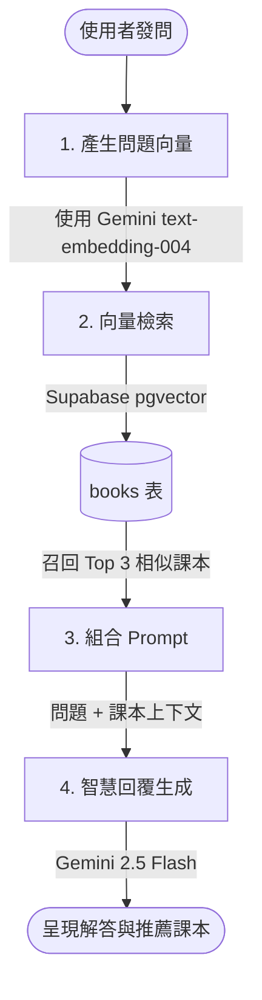

# ReBook 續頁 — RAG (檢索增強生成) 實作指南與技能規範

此技能用於指導 AI 助手在 ReBook 平台中整合 **Supabase (pgvector)** 與 **Gemini API**，建立語意檢索與智慧 AI 助理對話。

---

## 🏗️ 核心架構圖



---

## 🛠️ 資料庫端 SQL 設定 (pgvector)

在 Supabase 控制台的 **SQL Editor** 中執行以下指令：

### 1. 啟用 pgvector 延伸套件並新增向量欄位
```sql
-- 1. 啟用 pgvector 延伸套件
create extension if not exists vector;

-- 2. 在 books 表中新增 embedding 向量欄位 
-- Gemini text-embedding-004 產生的向量維度為 768
alter table books 
add column if not exists embedding vector(768);

-- 3. 建立向量索引 (HNSW) 以加速大型資料庫餘弦檢索
create index on books 
using hnsw (embedding vector_cosine_ops);
```

### 2. 建立 match_books 向量比對 RPC 函數
```sql
create or replace function match_books (
  query_embedding vector(768),
  match_threshold float,
  match_count int
)
returns table (
  id text,
  title text,
  author text,
  price numeric,
  school text,
  department text,
  similarity float
)
language sql stable
as $$
  select
    books.id,
    books.title,
    books.author,
    books.price,
    books.school,
    books.department,
    1 - (books.embedding <=> query_embedding) as similarity
  from books
  where 1 - (books.embedding <=> query_embedding) > match_threshold
  order by books.embedding <=> query_embedding
  limit match_count;
$$;
```

---

## 💻 TypeScript 程式碼實作

### 1. 新書上架時寫入 Embedding 向量
每當有新書上架時，需將書籍的描述文字呼叫 Gemini 生成向量後更新至資料庫。

```typescript
import { GoogleGenAI } from '@google/genai';
import { supabase } from './supabase';

const ai = new GoogleGenAI({ apiKey: import.meta.env.VITE_GEMINI_API_KEY });

/**
 * 產生書籍的特徵文字並生成向量，儲存至 Supabase
 */
export async function updateBookEmbedding(bookId: string, bookDetails: any) {
  const document = `
    書名: ${bookDetails.title}
    作者: ${bookDetails.author}
    學校: ${bookDetails.school}
    系所: ${bookDetails.department}
    教授: ${bookDetails.professor || '未註明'}
    面交地點: ${bookDetails.location}
  `.trim();

  try {
    const response = await ai.models.embedContent({
      model: 'text-embedding-004',
      contents: document,
    });

    const embedding = response.embedding.values;

    const { error } = await supabase
      .from('books')
      .update({ embedding })
      .eq('id', bookId);

    if (error) throw error;
    console.log(`書籍 ${bookId} 向量寫入成功！`);
  } catch (err) {
    console.error('產生向量失敗:', err);
  }
}
```

### 2. 實作 RAG 檢索與對話生成
當使用者在聊天室發問時，先生成問題向量，檢索最相似的在庫書籍，再送給 Gemini 生成人性化回覆。

```typescript
import { GoogleGenAI } from '@google/genai';
import { supabase } from './supabase';

const ai = new GoogleGenAI({ apiKey: import.meta.env.VITE_GEMINI_API_KEY });

/**
 * RAG 對答小助手核心邏輯
 */
export async function askReBookAssistant(userQuestion: string): Promise<string> {
  try {
    // 1. 將使用者問題轉換為向量
    const embedResponse = await ai.models.embedContent({
      model: 'text-embedding-004',
      contents: userQuestion,
    });
    const queryEmbedding = embedResponse.embedding.values;

    // 2. 呼叫 RPC 函數，檢索前 3 筆相似的課本
    const { data: matchedBooks, error } = await supabase.rpc('match_books', {
      query_embedding: queryEmbedding,
      match_threshold: 0.3,
      match_count: 3,
    });

    if (error) throw error;

    // 3. 將檢索到的課本資料格式化為上下文
    const context = matchedBooks && matchedBooks.length > 0
      ? matchedBooks.map((b: any) => 
          `- 《${b.title}》 作者: ${b.author} | 價格: ${b.price === null ? '免費贈送' : `NT$ ${b.price}`} | 學校: ${b.school} | 科系: ${b.department}`
        ).join('\n')
      : '目前資料庫中沒有高度相關的書籍。';

    // 4. 設定 Prompt 模版送給 Gemini 生成最終回答
    const prompt = `
      您是 ReBook 續頁二手教科書平台的智慧小助手。請根據以下平台「資料庫檢索到的相關課本資訊」，來回答使用者的問題。
      
      【相關課本資料庫】：
      ${context}
      
      【使用者問題】：
      "${userQuestion}"
      
      【請遵守以下回答原則】：
      1. 如果有找到合適的課本，請親切地向使用者推薦，並列出價格與學校。
      2. 如果檢索結果中沒有符合的書籍，請老實告知平台目前暫無該書籍，但可以建議他們加入「追蹤清單」，以便有書上架時即時通知。
      3. 回答一律使用「繁體中文」，語氣要溫和、熱情、充滿學院風。
    `.trim();

    const textResponse = await ai.models.generateContent({
      model: 'gemini-2.5-flash',
      contents: prompt,
    });

    return textResponse.text;
  } catch (err) {
    console.error('RAG 檢索與回答生成失敗:', err);
    return '抱歉，小助手伺服器忙碌中，請稍後再試！';
  }
}
```
